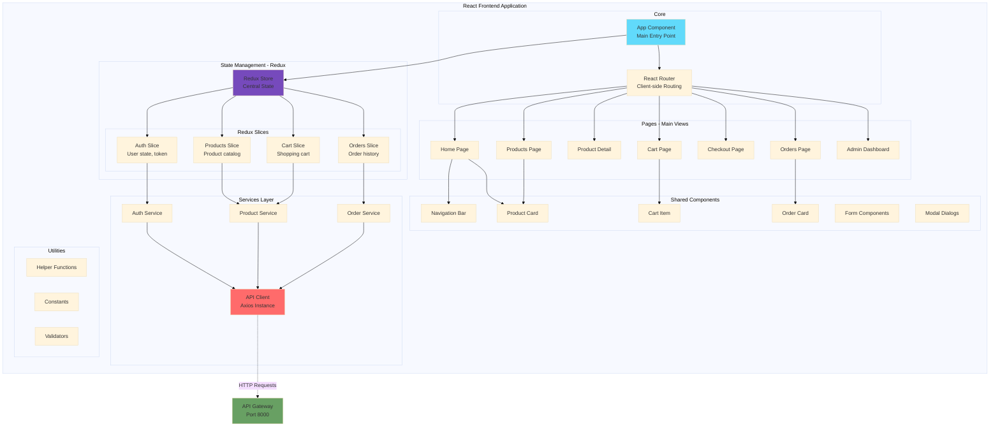
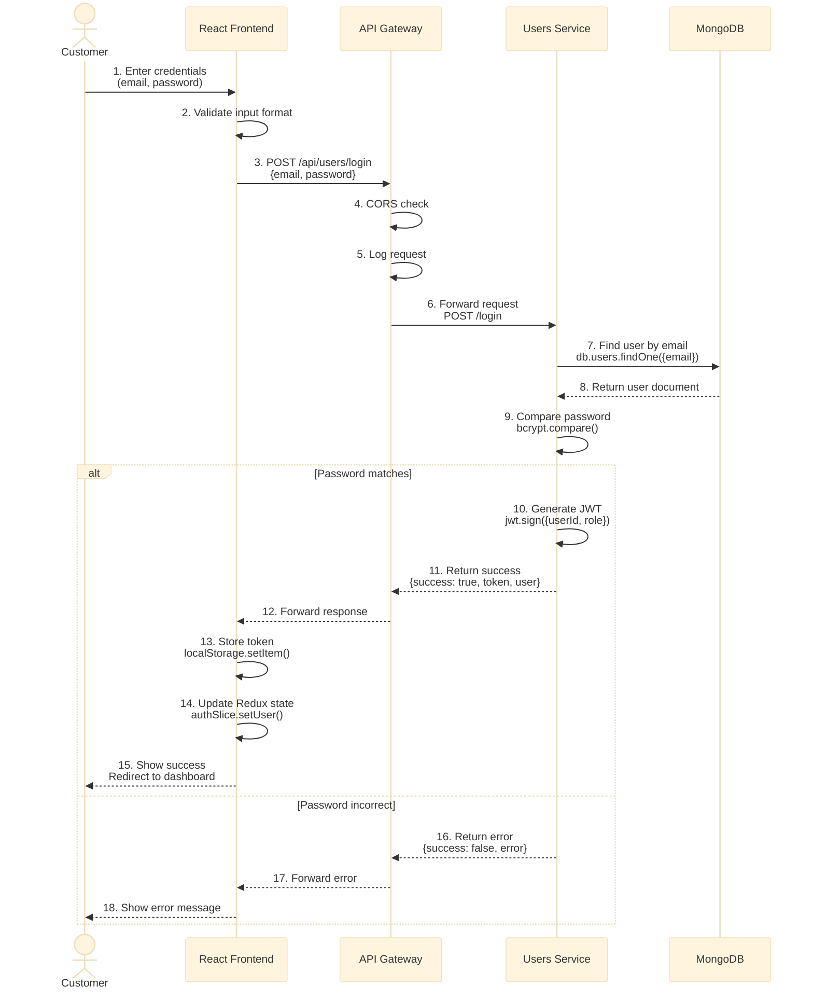
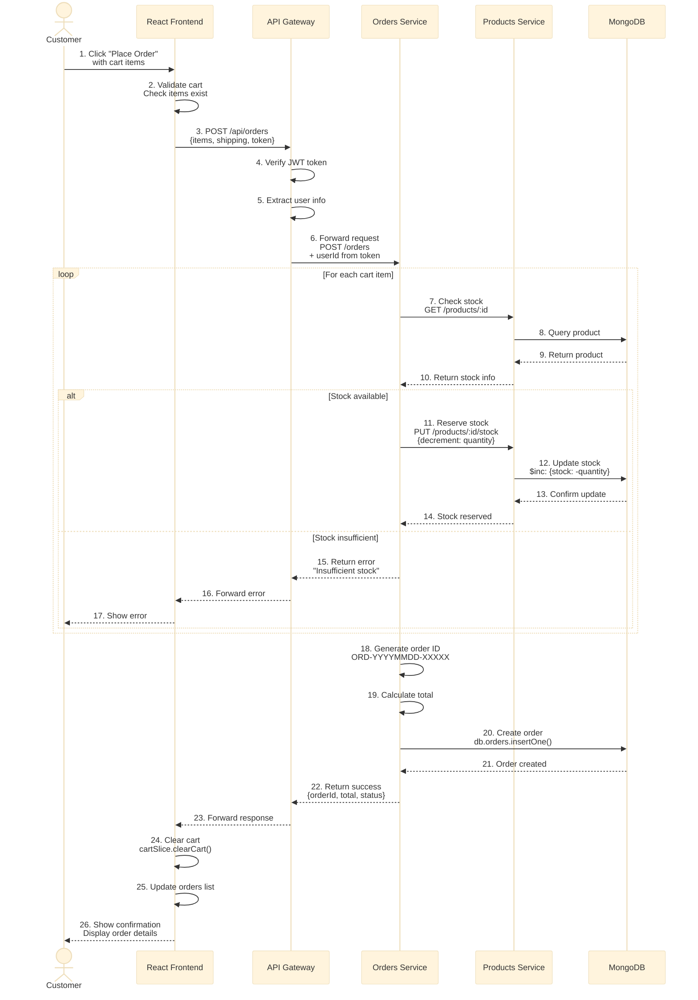
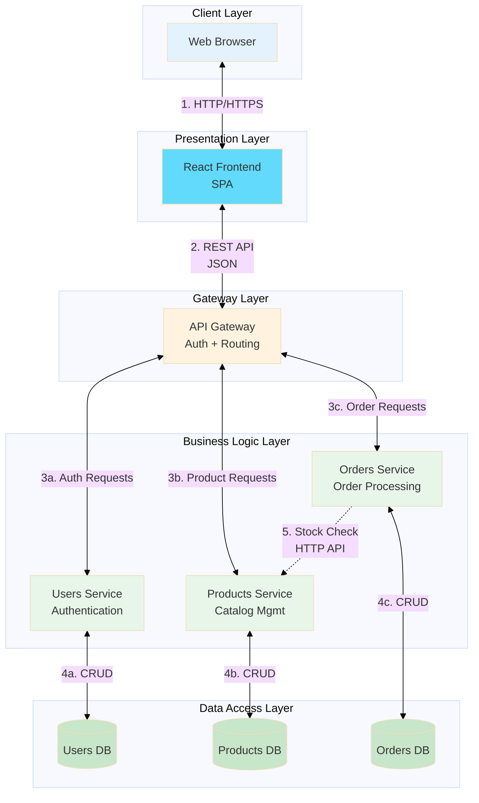
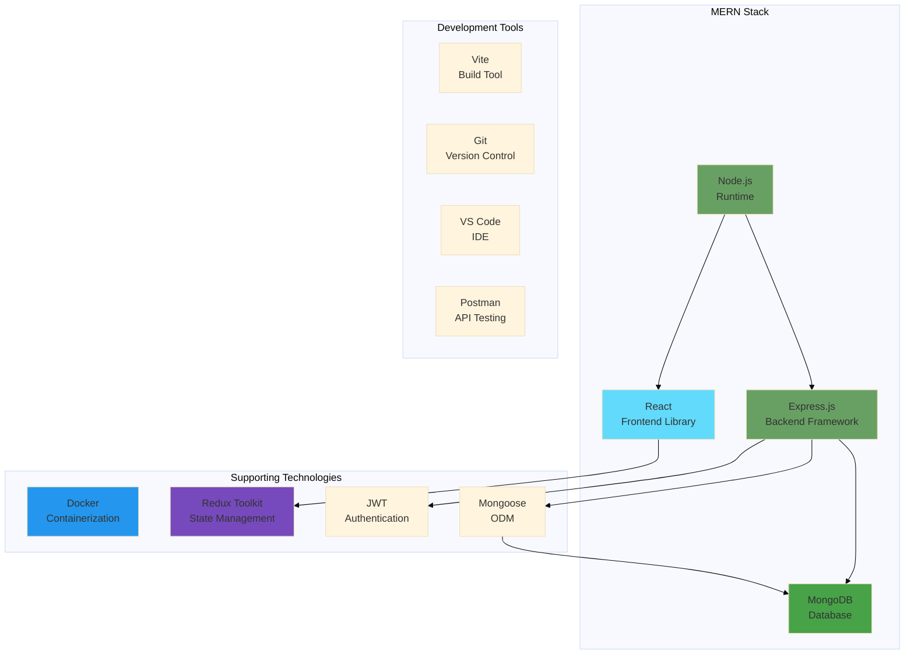

# SOFTWARE DOCUMENT: MICROSHOP E-COMMERCE PLATFORM

**Chapter 4: Architecture**

---

---

## 4. ARCHITECTURE

### 4.1. Architectural Style(s) Used

This section describes the architectural styles and patterns employed in the Microshop E-Commerce Platform.

#### 4.1.1. Primary Architectural Style: Microservices Architecture

**Definition:**

Microservices architecture is an architectural style that structures an application as a collection of small, autonomous services modeled around a business domain. Each service is self-contained, implements a specific business capability, and communicates with other services through well-defined APIs.

**Implementation in Microshop:**

The Microshop platform is built using a microservices architecture with the following independent services:

1. **Users Service** (Port 5001)
   - Business Domain: User management and authentication
   - Responsibilities:
     - User registration and login
     - JWT token generation and validation
     - User profile management
     - Password management
   - Database: MongoDB (microshop-users)
   - Independence: Can be deployed, scaled, and updated independently

2. **Products Service** (Port 5002)
   - Business Domain: Product catalog management
   - Responsibilities:
     - Product CRUD operations
     - Product search and filtering
     - Inventory tracking
     - Stock management
   - Database: MongoDB (microshop-products)
   - Independence: Can be deployed, scaled, and updated independently

3. **Orders Service** (Port 5003)
   - Business Domain: Order processing and management
   - Responsibilities:
     - Order creation and processing
     - Order status management
     - Order history tracking
     - Stock reservation coordination
   - Database: MongoDB (microshop-orders)
   - Independence: Can be deployed, scaled, and updated independently

**Key Characteristics:**

✅ **Service Independence:**
- Each service runs in its own process
- Each service has its own database (database per service pattern)
- Services communicate only through APIs
- No shared database or code between services

✅ **Business Domain Alignment:**
- Each service represents a clear business capability
- Services align with domain-driven design principles
- Bounded contexts are well-defined

✅ **Decentralized Data Management:**
- Each service owns its data
- No direct database access between services
- Data consistency through API calls

✅ **Independent Deployment:**
- Services can be deployed independently
- Rolling updates possible
- Different technologies can be used per service (though we use Node.js for all)

---

#### 4.1.2. Supporting Pattern: API Gateway Pattern

**Definition:**

The API Gateway pattern provides a single entry point for all clients. It sits between the clients and the microservices, handling request routing, composition, and protocol translation.

**Implementation in Microshop:**

**API Gateway Service** (Port 8000)
- Single entry point for all frontend requests
- Centralized authentication and authorization
- Request routing to appropriate backend services
- CORS configuration and security headers
- Rate limiting and throttling (future enhancement)

**Responsibilities:**
1. **Authentication & Authorization:**
   - JWT token validation
   - Role-based access control (user vs admin)
   - Authentication middleware

2. **Request Routing:**
   - Routes `/api/users/*` → Users Service (5001)
   - Routes `/api/products/*` → Products Service (5002)
   - Routes `/api/orders/*` → Orders Service (5003)

3. **Security:**
   - CORS policy enforcement
   - Security headers
   - Input validation
   - Request/response logging

4. **Cross-Cutting Concerns:**
   - Logging and monitoring
   - Error handling
   - Request/response transformation

**Benefits:**
- Single point of entry simplifies client code
- Centralized security management
- Easier to monitor and log all traffic
- Can add caching layer in future

---

#### 4.1.3. Supporting Pattern: Client-Server Architecture

**Definition:**

Client-Server architecture divides the system into two main components: clients (which request services) and servers (which provide services).

**Implementation in Microshop:**

**Client Tier (Frontend):**
- React Single Page Application (SPA)
- Runs in user's web browser
- Port: 5173 (development), 80/443 (production)
- Responsibilities:
  - User interface rendering
  - User interaction handling
  - State management (Redux)
  - API requests to server

**Server Tier (Backend):**
- Node.js/Express.js services
- Run on server infrastructure
- Responsibilities:
  - Business logic processing
  - Data persistence
  - Authentication and authorization
  - API endpoints

**Communication:**
- Protocol: HTTP/HTTPS
- Data Format: JSON
- API Style: RESTful

**Benefits:**
- Clear separation of concerns
- Independent scaling of frontend and backend
- Technology independence (can replace frontend without affecting backend)
- Multiple clients can use same backend (web, mobile in future)

---

#### 4.1.4. Supporting Pattern: Model-View-Controller (MVC)

**Definition:**

MVC is a design pattern that separates application into three interconnected components: Model (data), View (presentation), and Controller (logic).

**Implementation in Microshop:**

**Backend Services (MVC Pattern):**

```
Service Structure:
├── models/         → Model (Data Layer)
│   ├── User.js
│   ├── Product.js
│   └── Order.js
├── controllers/    → Controller (Business Logic)
│   ├── userController.js
│   ├── productController.js
│   └── orderController.js
├── routes/         → Routes (URL Mapping)
│   ├── userRoutes.js
│   ├── productRoutes.js
│   └── orderRoutes.js
└── middleware/     → Middleware (Cross-cutting concerns)
    ├── auth.js
    └── errorHandler.js
```

**Model Layer:**
- Mongoose schemas defining data structure
- Data validation rules
- Database interactions through ODM

**Controller Layer:**
- Business logic implementation
- Request processing
- Response formatting
- Service coordination

**View Layer (API Responses):**
- JSON response formatting
- HTTP status codes
- Error messages

**Frontend (Component-Based Architecture):**

```
Frontend Structure:
├── components/     → Reusable UI Components
├── pages/          → Page Components (Views)
├── features/       → Feature Modules (Redux Slices)
├── app/            → Redux Store Configuration
└── utils/          → Utility Functions
```

---

#### 4.1.5. Architectural Style Comparison Table

| Aspect | Microservices | Monolithic | Rationale for Choice |
|--------|---------------|------------|---------------------|
| **Scalability** | High - Scale services independently | Limited - Scale entire app | Microservices chosen for better scalability |
| **Development** | Parallel development possible | Sequential development | Enables 4-person team to work in parallel |
| **Deployment** | Independent deployment | Single deployment | Reduces deployment risk |
| **Technology** | Different tech per service | Single tech stack | Allows experimentation (though we use same stack) |
| **Complexity** | Higher operational complexity | Lower complexity | Trade-off accepted for learning and scalability |
| **Database** | Database per service | Shared database | Better service independence |
| **Communication** | Network calls (REST APIs) | In-process calls | Acceptable latency for our use case |
| **Testing** | Complex integration testing | Simpler testing | Requires more testing effort but better isolation |

---

### 4.2. Architectural Model

This section presents comprehensive architectural models and diagrams for the Microshop E-Commerce Platform.

#### 4.2.1. System Context Diagram (C4 Model - Level 1)

This diagram shows the system as a whole and its interactions with external actors.

```mermaid
%%{init: {'theme':'base'}}%%
graph TB
    subgraph "External Actors"
        Customer[👤 Customer<br/>Web Browser]
        Admin[👨‍💼 Administrator<br/>Web Browser]
    end
    
    subgraph "Microshop E-Commerce Platform"
        System[Microshop System<br/>MERN Stack Application<br/>Microservices Architecture]
    end
    
    subgraph "External Systems"
        Email[📧 Email Service<br/>Future Integration]
        Payment[💳 Payment Gateway<br/>Future Integration]
        Shipping[🚚 Shipping Provider<br/>Future Integration]
    end
    
    Customer -->|Browse products<br/>Place orders<br/>Track orders| System
    Admin -->|Manage products<br/>Process orders<br/>View analytics| System
    
    System -.->|Send notifications<br/>Future| Email
    System -.->|Process payments<br/>Future| Payment
    System -.->|Track shipments<br/>Future| Shipping
    
    style System fill:#4CAF50
    style Customer fill:#2196F3
    style Admin fill:#FF9800
    style Email fill:#E0E0E0
    style Payment fill:#E0E0E0
    style Shipping fill:#E0E0E0
```



**Legend:**
- **Solid lines:** Current implementation
- **Dashed lines:** Future integrations
- **Blue:** Customer actor
- **Orange:** Admin actor
- **Green:** Main system
- **Gray:** External systems (future)

---

#### 4.2.2. Container Diagram (C4 Model - Level 2)

This diagram shows the high-level containers (applications, services) that make up the system.

```mermaid
%%{init: {'theme':'base'}}%%
graph TB
    subgraph "Client Layer - Port 5173 (dev) / 80,443 (prod)"
        Frontend[React SPA<br/>Frontend Application<br/>━━━━━━━━━━<br/>• React 18<br/>• Redux Toolkit<br/>• Tailwind CSS<br/>• Axios<br/>━━━━━━━━━━<br/>User Interface]
    end
    
    subgraph "API Layer - Port 8000"
        Gateway[API Gateway<br/>Express.js<br/>━━━━━━━━━━<br/>• Request Routing<br/>• Authentication<br/>• CORS<br/>• Logging<br/>━━━━━━━━━━<br/>Single Entry Point]
    end
    
    subgraph "Service Layer - Ports 5001, 5002, 5003"
        UsersService[Users Service<br/>Node.js + Express<br/>━━━━━━━━━━<br/>Port: 5001<br/>━━━━━━━━━━<br/>• Registration<br/>• Login/Auth<br/>• Profile Mgmt]
        
        ProductsService[Products Service<br/>Node.js + Express<br/>━━━━━━━━━━<br/>Port: 5002<br/>━━━━━━━━━━<br/>• CRUD Products<br/>• Search/Filter<br/>• Inventory]
        
        OrdersService[Orders Service<br/>Node.js + Express<br/>━━━━━━━━━━<br/>Port: 5003<br/>━━━━━━━━━━<br/>• Order Processing<br/>• Status Tracking<br/>• History]
    end
    
    subgraph "Data Layer - Port 27017"
        UsersDB[(MongoDB<br/>users-db)]
        ProductsDB[(MongoDB<br/>products-db)]
        OrdersDB[(MongoDB<br/>orders-db)]
    end
    
    Frontend -->|HTTP/HTTPS<br/>REST API<br/>JSON| Gateway
    
    Gateway -->|Route /users/*<br/>HTTP| UsersService
    Gateway -->|Route /products/*<br/>HTTP| ProductsService
    Gateway -->|Route /orders/*<br/>HTTP| OrdersService
    
    UsersService -->|Mongoose ODM<br/>Read/Write| UsersDB
    ProductsService -->|Mongoose ODM<br/>Read/Write| ProductsDB
    OrdersService -->|Mongoose ODM<br/>Read/Write| OrdersDB
    
    OrdersService -.->|Check stock<br/>HTTP API Call| ProductsService
    
    style Frontend fill:#61DAFB
    style Gateway fill:#68A063
    style UsersService fill:#68A063
    style ProductsService fill:#68A063
    style OrdersService fill:#68A063
    style UsersDB fill:#47A248
    style ProductsDB fill:#47A248
    style OrdersDB fill:#47A248
```



**Technology Colors:**
- **Blue (#61DAFB):** React
- **Green (#68A063):** Node.js/Express
- **Dark Green (#47A248):** MongoDB

---

#### 4.2.3. Component Diagram - Frontend Architecture

This diagram shows the internal structure of the React frontend application.



---

#### 4.2.4. Component Diagram - Backend Service Architecture

This diagram shows the internal structure of a typical backend microservice.

```mermaid
%%{init: {'theme':'base'}}%%
graph TB
    subgraph "Backend Microservice Architecture"
        direction TB
        
        subgraph "Entry Point"
            Server[server.js<br/>Express App<br/>Port Configuration]
        end
        
        subgraph "Configuration"
            Config[config/database.js<br/>MongoDB Connection<br/>Environment Variables]
        end
        
        subgraph "Middleware Layer"
            Auth[auth.js<br/>JWT Verification<br/>Role Checking]
            ErrorHandler[errorHandler.js<br/>Global Error Handler]
            Logger[Logger Middleware<br/>Request/Response Logs]
            CORS[CORS Middleware<br/>Cross-Origin Config]
        end
        
        subgraph "Routes Layer"
            Routes[Routes<br/>URL → Controller Mapping]
            UserRoutes[userRoutes.js]
            ProductRoutes[productRoutes.js]
            OrderRoutes[orderRoutes.js]
        end
        
        subgraph "Controllers Layer"
            Controllers[Controllers<br/>Business Logic]
            UserController[userController.js<br/>• register<br/>• login<br/>• getProfile<br/>• updateProfile]
            ProductController[productController.js<br/>• getProducts<br/>• getProductById<br/>• createProduct<br/>• updateProduct<br/>• deleteProduct]
            OrderController[orderController.js<br/>• createOrder<br/>• getOrders<br/>• getOrderById<br/>• updateStatus]
        end
        
        subgraph "Models Layer"
            Models[Models<br/>Mongoose Schemas]
            UserModel[User.js<br/>• name, email, password<br/>• role, timestamps]
            ProductModel[Product.js<br/>• title, price, stock<br/>• category, specs]
            OrderModel[Order.js<br/>• user, items, total<br/>• status, shipping]
        end
        
        subgraph "Database"
            MongoDB[(MongoDB<br/>Document Store)]
        end
    end
    
    Server --> Config
    Server --> Auth
    Server --> ErrorHandler
    Server --> Logger
    Server --> CORS
    Server --> Routes
    
    Routes --> UserRoutes
    Routes --> ProductRoutes
    Routes --> OrderRoutes
    
    UserRoutes --> Auth
    UserRoutes --> UserController
    ProductRoutes --> Auth
    ProductRoutes --> ProductController
    OrderRoutes --> Auth
    OrderRoutes --> OrderController
    
    UserController --> UserModel
    ProductController --> ProductModel
    OrderController --> OrderModel
    
    UserModel --> MongoDB
    ProductModel --> MongoDB
    OrderModel --> MongoDB
    
    style Server fill:#68A063
    style Controllers fill:#4CAF50
    style Models fill:#47A248
    style MongoDB fill:#47A248
    style Auth fill:#FF9800
```



---

#### 4.2.5. Deployment Diagram - Docker Container Architecture

This diagram shows how the system is deployed using Docker containers.

```mermaid
%%{init: {'theme':'base'}}%%
graph TB
    subgraph "Docker Host Machine"
        direction TB
        
        subgraph "Docker Network: microshop-network"
            direction TB
            
            subgraph "Frontend Container"
                FrontendApp[React App<br/>━━━━━━━━━━<br/>Nginx Server<br/>Port: 5173 → 80<br/>━━━━━━━━━━<br/>Image: node:18-alpine<br/>+ nginx:alpine]
            end
            
            subgraph "API Gateway Container"
                GatewayApp[API Gateway<br/>━━━━━━━━━━<br/>Express.js<br/>Port: 8000<br/>━━━━━━━━━━<br/>Image: node:18-alpine]
            end
            
            subgraph "Users Service Container"
                UsersApp[Users Service<br/>━━━━━━━━━━<br/>Express.js<br/>Port: 5001<br/>━━━━━━━━━━<br/>Image: node:18-alpine]
            end
            
            subgraph "Products Service Container"
                ProductsApp[Products Service<br/>━━━━━━━━━━<br/>Express.js<br/>Port: 5002<br/>━━━━━━━━━━<br/>Image: node:18-alpine]
            end
            
            subgraph "Orders Service Container"
                OrdersApp[Orders Service<br/>━━━━━━━━━━<br/>Express.js<br/>Port: 5003<br/>━━━━━━━━━━<br/>Image: node:18-alpine]
            end
            
            subgraph "MongoDB Container"
                MongoApp[MongoDB Server<br/>━━━━━━━━━━<br/>Port: 27017<br/>━━━━━━━━━━<br/>Image: mongo:7<br/>━━━━━━━━━━<br/>Databases:<br/>• users-db<br/>• products-db<br/>• orders-db]
            end
        end
        
        subgraph "Docker Volumes"
            MongoVolume[(mongo-data<br/>Persistent Storage)]
        end
    end
    
    subgraph "External Access"
        Browser[Web Browser]
        APIClient[API Client<br/>e.g., Postman]
    end
    
    Browser -->|Port 5173/80| FrontendApp
    APIClient -->|Port 8000| GatewayApp
    
    FrontendApp -->|Internal Network| GatewayApp
    
    GatewayApp -->|Internal Network<br/>Port 5001| UsersApp
    GatewayApp -->|Internal Network<br/>Port 5002| ProductsApp
    GatewayApp -->|Internal Network<br/>Port 5003| OrdersApp
    
    UsersApp -->|Port 27017| MongoApp
    ProductsApp -->|Port 27017| MongoApp
    OrdersApp -->|Port 27017| MongoApp
    
    MongoApp -->|Mount| MongoVolume
    
    style FrontendApp fill:#61DAFB
    style GatewayApp fill:#68A063
    style UsersApp fill:#68A063
    style ProductsApp fill:#68A063
    style OrdersApp fill:#68A063
    style MongoApp fill:#47A248
    style MongoVolume fill:#FFB74D
```



**Docker Compose Configuration:**
```yaml
version: '3.8'
services:
  mongodb:
    image: mongo:7
    ports: ["27017:27017"]
    volumes: [mongo-data:/data/db]
  
  users-service:
    build: ./services/users
    ports: ["5001:5001"]
    depends_on: [mongodb]
  
  products-service:
    build: ./services/products
    ports: ["5002:5002"]
    depends_on: [mongodb]
  
  orders-service:
    build: ./services/orders
    ports: ["5003:5003"]
    depends_on: [mongodb]
  
  gateway:
    build: ./gateway
    ports: ["8000:8000"]
    depends_on: [users-service, products-service, orders-service]
  
  frontend:
    build: ./frontend
    ports: ["5173:80"]
    depends_on: [gateway]

volumes:
  mongo-data:

networks:
  default:
    name: microshop-network
```

---

#### 4.2.6. Data Flow Diagram - User Authentication Flow

This diagram shows how data flows during user authentication.



---

#### 4.2.7. Data Flow Diagram - Order Creation Flow

This diagram shows the complete flow of creating an order, including service-to-service communication.



---

#### 4.2.8. Network Architecture Diagram

This diagram shows the network topology and communication paths.

```mermaid
%%{init: {'theme':'base'}}%%
graph TB
    subgraph "Internet"
        Users[👥 End Users<br/>Customers & Admins]
    end
    
    subgraph "DMZ / Load Balancer Future"
        LB[⚖️ Load Balancer<br/>Future Enhancement<br/>Nginx / HAProxy]
    end
    
    subgraph "Application Network - Docker Network"
        direction TB
        
        subgraph "Frontend Tier"
            FE[Frontend Container<br/>━━━━━━━━━━<br/>Nginx + React<br/>Port: 80/443]
        end
        
        subgraph "Gateway Tier"
            GW[API Gateway<br/>━━━━━━━━━━<br/>Express.js<br/>Port: 8000<br/>━━━━━━━━━━<br/>Auth + Routing]
        end
        
        subgraph "Service Tier"
            US[Users Service<br/>Port: 5001]
            PS[Products Service<br/>Port: 5002]
            OS[Orders Service<br/>Port: 5003]
        end
        
        subgraph "Data Tier"
            DB[(MongoDB<br/>Port: 27017<br/>━━━━━━━━━━<br/>3 Databases)]
        end
    end
    
    subgraph "Storage"
        Vol[(Docker Volume<br/>Persistent Data)]
    end
    
    Users -->|HTTPS<br/>Port 443| LB
    LB -.->|HTTP<br/>Port 80| FE
    
    FE -->|REST API<br/>Port 8000<br/>JSON| GW
    
    GW -->|HTTP<br/>Port 5001| US
    GW -->|HTTP<br/>Port 5002| PS
    GW -->|HTTP<br/>Port 5003| OS
    
    US -->|MongoDB Protocol<br/>Port 27017| DB
    PS -->|MongoDB Protocol<br/>Port 27017| DB
    OS -->|MongoDB Protocol<br/>Port 27017| DB
    
    OS -.->|Service-to-Service<br/>HTTP API| PS
    
    DB -->|Mount| Vol
    
    style Users fill:#2196F3
    style LB fill:#E0E0E0
    style FE fill:#61DAFB
    style GW fill:#FF9800
    style US fill:#4CAF50
    style PS fill:#4CAF50
    style OS fill:#4CAF50
    style DB fill:#47A248
    style Vol fill:#FFB74D
```



**Network Configuration:**

| Component | Network | Port | Protocol | Accessibility |
|-----------|---------|------|----------|---------------|
| Frontend | microshop-network | 5173/80 | HTTP | Public |
| API Gateway | microshop-network | 8000 | HTTP | Public |
| Users Service | microshop-network | 5001 | HTTP | Internal only |
| Products Service | microshop-network | 5002 | HTTP | Internal only |
| Orders Service | microshop-network | 5003 | HTTP | Internal only |
| MongoDB | microshop-network | 27017 | MongoDB Protocol | Internal only |

**Security Boundaries:**
- ✅ Only Frontend and Gateway exposed to public
- ✅ Backend services accessible only within Docker network
- ✅ MongoDB accessible only by backend services
- ✅ API Gateway acts as security gateway

---

#### 4.2.9. System Interaction Diagram

This diagram shows all possible interactions between system components.



**Interaction Types:**

1. **Client ↔ Frontend (Synchronous)**
   - User actions trigger component updates
   - React re-renders based on state changes
   - Browser DOM manipulation

2. **Frontend ↔ Gateway (Asynchronous)**
   - HTTP requests via Axios
   - JSON request/response
   - Authentication headers (JWT in Bearer token)

3. **Gateway ↔ Services (Synchronous)**
   - HTTP forwarding based on route
   - Header propagation (auth token)
   - Response aggregation

4. **Services ↔ Database (Asynchronous)**
   - Mongoose ODM queries
   - Connection pooling
   - CRUD operations

5. **Service ↔ Service (Asynchronous)**
   - HTTP REST API calls
   - Currently: Orders → Products (stock check)
   - Future: More inter-service communication

---

### 4.3. Technology, Software, and Hardware Used

This section provides a comprehensive list of all technologies, software, and hardware used in the Microshop E-Commerce Platform.

#### 4.3.1. Technology Stack Summary



---

#### 4.3.2. Backend Technologies

**4.3.2.1. Runtime Environment**

| Technology | Version | Purpose | Justification |
|------------|---------|---------|---------------|
| **Node.js** | v18.x+ | JavaScript runtime for server-side code | • Mature and stable LTS version<br/>• Excellent performance for I/O operations<br/>• Large ecosystem (npm)<br/>• Same language as frontend (JavaScript)<br/>• Async/await support<br/>• Event-driven architecture |

**4.3.2.2. Web Framework**

| Technology | Version | Purpose | Justification |
|------------|---------|---------|---------------|
| **Express.js** | ^4.19.2 | Web application framework for Node.js | • Minimalist and flexible<br/>• Robust routing<br/>• Middleware support<br/>• Large community<br/>• Easy to learn<br/>• Well-documented<br/>• Industry standard |

**4.3.2.3. Database & ODM**

| Technology | Version | Purpose | Justification |
|------------|---------|---------|---------------|
| **MongoDB** | v7.x+ | NoSQL document database | • Schema flexibility (good for evolving requirements)<br/>• JSON-like documents (matches JavaScript objects)<br/>• Horizontal scalability<br/>• Good for microservices (database per service)<br/>• Rich query language<br/>• Aggregation framework<br/>• Free and open-source |
| **Mongoose** | ^8.3.2 | MongoDB ODM (Object Document Mapper) | • Schema definition and validation<br/>• Type casting<br/>• Query building<br/>• Middleware (hooks)<br/>• Population (joins)<br/>• Connection management<br/>• Makes MongoDB easier to work with |

**4.3.2.4. Authentication & Security**

| Technology | Version | Purpose | Justification |
|------------|---------|---------|---------------|
| **jsonwebtoken** | ^9.0.2 | JWT token generation and verification | • Stateless authentication<br/>• Scalable (no session storage needed)<br/>• Works well with microservices<br/>• Industry standard<br/>• Secure when implemented correctly |
| **bcryptjs** | ^2.4.3 | Password hashing | • Secure one-way encryption<br/>• Salt generation<br/>• Adjustable cost factor<br/>• Protection against rainbow table attacks<br/>• Industry standard for password storage |
| **cors** | ^2.8.5 | Cross-Origin Resource Sharing | • Enables frontend-backend communication<br/>• Configurable security<br/>• Simple to implement |

**4.3.2.5. Middleware & Utilities**

| Technology | Version | Purpose | Justification |
|------------|---------|---------|---------------|
| **dotenv** | ^16.4.5 | Environment variable management | • Keeps secrets out of code<br/>• Different configs for dev/prod<br/>• Security best practice<br/>• Simple to use |
| **morgan** | ^1.10.0 | HTTP request logging | • Debugging and monitoring<br/>• Multiple log formats<br/>• Minimal overhead<br/>• Stream support |
| **express-async-handler** | ^1.2.0 | Async error handling in Express | • Eliminates try-catch boilerplate<br/>• Cleaner controller code<br/>• Automatic error forwarding to error handler |

---

#### 4.3.3. Frontend Technologies

**4.3.3.1. Core Framework**

| Technology | Version | Purpose | Justification |
|------------|---------|---------|---------------|
| **React** | ^18.2.0 | UI component library | • Component-based architecture<br/>• Virtual DOM (performance)<br/>• Large ecosystem<br/>• Hooks API (modern state management)<br/>• Reusable components<br/>• Strong community<br/>• Industry leader |
| **React DOM** | ^18.2.0 | React renderer for web | • Required for React web apps<br/>• Efficient DOM updates<br/>• Concurrent rendering features |

**4.3.3.2. State Management**

| Technology | Version | Purpose | Justification |
|------------|---------|---------|---------------|
| **Redux Toolkit** | ^2.9.1 | Global state management | • Simplified Redux (less boilerplate)<br/>• Built-in best practices<br/>• Immutability with Immer<br/>• DevTools support<br/>• Async logic with thunks<br/>• Easier than vanilla Redux |

**4.3.3.3. Routing**

| Technology | Version | Purpose | Justification |
|------------|---------|---------|---------------|
| **React Router DOM** | ^6.22.3 | Client-side routing for SPA | • Declarative routing<br/>• Nested routes<br/>• Protected routes (authentication)<br/>• URL parameters<br/>• Browser history management<br/>• Industry standard for React |

**4.3.3.4. HTTP Client**

| Technology | Version | Purpose | Justification |
|------------|---------|---------|---------------|
| **Axios** | ^1.9.0 | Promise-based HTTP client | • Better API than fetch<br/>• Request/response interceptors<br/>• Automatic JSON transformation<br/>• Request cancellation<br/>• Error handling<br/>• CSRF protection |

**4.3.3.5. Styling**

| Technology | Version | Purpose | Justification |
|------------|---------|---------|---------------|
| **Tailwind CSS** | ^3.4.17 | Utility-first CSS framework | • Rapid development<br/>• Consistent design system<br/>• No CSS file switching<br/>• Responsive utilities<br/>• Small production bundle (purge)<br/>• Easy customization<br/>• Modern and popular |
| **Framer Motion** | ^12.23.24 | Animation library for React | • Smooth animations<br/>• Gesture support<br/>• Layout animations<br/>• Declarative API<br/>• Better UX with transitions |

**4.3.3.6. Data Visualization**

| Technology | Version | Purpose | Justification |
|------------|---------|---------|---------------|
| **Chart.js** | ^4.5.1 | JavaScript charting library | • Responsive charts<br/>• Multiple chart types<br/>• Customizable<br/>• Good performance<br/>• Free and open-source |
| **React Chart.js 2** | ^5.3.0 | React wrapper for Chart.js | • React component integration<br/>• Hooks support<br/>• Props-based configuration |

**4.3.3.7. UI Components & Utilities**

| Technology | Version | Purpose | Justification |
|------------|---------|---------|---------------|
| **React Icons** | ^5.5.0 | Icon library | • Large icon collection<br/>• Tree-shakeable<br/>• Consistent API<br/>• No external dependencies |
| **Sonner** | ^1.8.0 | Toast notification library | • Beautiful toasts<br/>• Promise-based API<br/>• Minimal setup<br/>• Good UX |

**4.3.3.8. Build Tools**

| Technology | Version | Purpose | Justification |
|------------|---------|---------|---------------|
| **Vite** | ^5.0.8 | Frontend build tool and dev server | • Extremely fast HMR (Hot Module Replacement)<br/>• Native ES modules<br/>• Optimized builds<br/>• Better DX than Webpack<br/>• Modern and actively developed |

---

#### 4.3.4. DevOps & Deployment Technologies

**4.3.4.1. Containerization**

| Technology | Version | Purpose | Justification |
|------------|---------|---------|---------------|
| **Docker** | v20.x+ | Container platform | • Consistent environments (dev/prod parity)<br/>• Easy deployment<br/>• Service isolation<br/>• Resource efficiency<br/>• Microservices enabler<br/>• Industry standard |
| **Docker Compose** | v2.x+ | Multi-container orchestration | • Define entire stack in YAML<br/>• Single command deployment<br/>• Service dependencies<br/>• Networking automation<br/>• Volume management<br/>• Great for development |

**4.3.4.2. Version Control**

| Technology | Version | Purpose | Justification |
|------------|---------|---------|---------------|
| **Git** | v2.x+ | Version control system | • Industry standard<br/>• Distributed system<br/>• Branching and merging<br/>• Collaboration support<br/>• History tracking |
| **GitHub** | Cloud | Git hosting and collaboration | • Free for public/private repos<br/>• Pull requests<br/>• Issue tracking<br/>• CI/CD integration<br/>• Team collaboration features |

---

#### 4.3.5. Development Tools

**4.3.5.1. IDEs & Editors**

| Tool | Purpose | Team Usage |
|------|---------|------------|
| **Visual Studio Code** | Primary code editor | All 4 members |
| **WebStorm** | JavaScript IDE (optional) | 1-2 members |

**VS Code Extensions Used:**
- ESLint - Code linting
- Prettier - Code formatting
- Thunder Client / REST Client - API testing
- Docker - Container management
- GitLens - Enhanced Git integration
- Tailwind CSS IntelliSense - Tailwind autocomplete
- ES7+ React/Redux snippets - Code snippets

**4.3.5.2. Testing & Debugging Tools**

| Tool | Purpose | Usage |
|------|---------|-------|
| **Chrome DevTools** | Browser debugging | Frontend debugging, network inspection |
| **React Developer Tools** | React debugging | Component tree, props, state inspection |
| **Redux DevTools** | Redux debugging | State changes, actions, time-travel debugging |
| **Postman** | API testing | API endpoint testing, request collections |
| **MongoDB Compass** | Database GUI | Database visualization, query testing |

**4.3.5.3. Project Management**

| Tool | Purpose | Usage |
|------|---------|-------|
| **Notion** | Documentation, task tracking | Project documentation, Kanban boards |
| **Discord / Slack** | Team communication | Daily updates, discussions |

---

#### 4.3.6. Hardware Requirements

**4.3.6.1. Development Environment (Per Developer)**

| Component | Minimum | Recommended | Team Status |
|-----------|---------|-------------|-------------|
| **CPU** | Intel Core i5 / AMD Ryzen 5 (4 cores) | Intel Core i7 / AMD Ryzen 7 (8 cores) | ✅ All members meet requirements |
| **RAM** | 8 GB | 16 GB | ✅ All members have 8-16 GB |
| **Storage** | 256 GB SSD | 512 GB SSD | ✅ Sufficient for all |
| **Network** | 10 Mbps | 50+ Mbps | ✅ Stable connections |
| **Display** | 1920x1080 | 2K+ | ✅ Full HD+ displays |

**Operating Systems Used:**
- Windows 10/11: 3 members
- macOS: 1 member
- Linux (Ubuntu): 0 members (but supported)

**4.3.6.2. Production Environment (Deployment)**

| Component | Specification | Purpose |
|-----------|---------------|---------|
| **Server** | VPS or Cloud Instance | Application hosting |
| **CPU** | 2-4 vCPUs | Running all containers |
| **RAM** | 4-8 GB | Multiple services + database |
| **Storage** | 50-100 GB SSD | Code, database, logs |
| **Network** | 100 Mbps+ | User traffic handling |
| **OS** | Linux (Ubuntu 22.04 LTS) | Docker host |

**Current Deployment:**
- Development: Local machines (Docker Desktop)
- Production: To be determined (Docker Compose on VPS or cloud platform)

---

#### 4.3.7. External Services (Future Integrations)

| Service | Purpose | Status | Priority |
|---------|---------|--------|----------|
| **Email Service** | Order confirmations, notifications | Planned | High |
| **Payment Gateway** | Online payments | Planned | High |
| **CDN** | Static asset delivery | Planned | Medium |
| **Monitoring** | Application monitoring, logging | Planned | Medium |
| **Analytics** | User behavior tracking | Planned | Low |

---

#### 4.3.8. Technology Learning Journey

**New Technologies Learned by Team:**

All 4 team members learned these technologies from scratch:

✅ **Nguyen Tran Hoang Nhan:**
- Node.js & Express.js
- Microservices architecture
- Docker & Docker Compose
- MongoDB & Mongoose
- JWT authentication
- RESTful API design

✅ **Mai Hoang Thai:**
- React 18 & Hooks
- Redux Toolkit
- Tailwind CSS
- Vite build tool
- Framer Motion
- Responsive design

✅ **Nguyen Nhut Khang:**
- Full-stack integration
- Axios & API calls
- JWT authentication (frontend & backend)
- Service-to-service communication
- Error handling patterns

✅ **Phan Tran Minh Quang:**
- Git workflows
- Docker basics
- Testing methodologies
- Notion project management
- Code review processes

**Learning Resources Used:**
- Official documentation (React, Express, MongoDB)
- YouTube tutorials
- Online courses (Udemy, freeCodeCamp)
- Stack Overflow
- GitHub repositories
- Team knowledge sharing

---

### 4.4. Rationale for Architectural Style and Model

This section explains the reasoning behind architectural decisions and compares alternatives.

#### 4.4.1. Why Microservices Architecture?

**Decision:** Use microservices architecture instead of monolithic architecture

**Rationale:**

**✅ Advantages for Our Project:**

1. **Learning Opportunity**
   - Team wanted to learn modern architectural patterns
   - Microservices is industry-relevant and highly demanded skill
   - Exposure to distributed systems concepts
   - Better resume/portfolio material

2. **Independent Service Development**
   - 4-person team can work in parallel
   - Users Service: 1 developer
   - Products Service: 1 developer
   - Orders Service: 1 developer
   - Frontend + Gateway: 1 developer
   - Reduces merge conflicts and coordination overhead

3. **Technology Experimentation**
   - Each service could use different technologies (though we chose same stack)
   - Easier to try new libraries in one service without affecting others
   - Can upgrade services independently

4. **Scalability (Future)**
   - Can scale heavily-used services (e.g., Products) independently
   - Don't need to scale entire application
   - Cost-effective in cloud environments

5. **Fault Isolation**
   - If Orders Service fails, Users and Products still work
   - Better availability
   - Easier debugging (isolate problems to specific service)

6. **Clear Service Boundaries**
   - Forces good separation of concerns
   - Each service has single responsibility
   - Easier to understand codebase

**⚠️ Trade-offs Accepted:**

1. **Increased Complexity**
   - More moving parts to manage
   - Service-to-service communication adds latency
   - **Mitigation:** Docker Compose simplifies local development
   - **Mitigation:** Clear API contracts between services

2. **Deployment Overhead**
   - Need to deploy multiple services
   - **Mitigation:** Docker containerization makes deployment consistent
   - **Mitigation:** Docker Compose for single-command deployment

3. **Testing Complexity**
   - Need integration testing across services
   - **Mitigation:** Well-defined API contracts
   - **Mitigation:** Postman collections for API testing

4. **Data Consistency Challenges**
   - No ACID transactions across services
   - **Mitigation:** Design to minimize cross-service transactions
   - **Mitigation:** Eventual consistency is acceptable for our use case

**❌ Why Not Monolithic?**

| Aspect | Monolithic | Our Decision |
|--------|------------|--------------|
| **Simplicity** | ✅ Simpler to develop | ❌ Accepted complexity for learning |
| **Single Deployment** | ✅ Easier deployment | ❌ Docker Compose makes multi-service deployment easy |
| **In-Process Communication** | ✅ Faster | ❌ Network latency acceptable for our scale |
| **Shared Database** | ✅ ACID transactions | ❌ Microservices benefits outweigh |
| **Learning Value** | ❌ Less impressive | ✅ Better for portfolio and learning |
| **Scalability** | ❌ Limited | ✅ Better for future growth |

**Conclusion:** Microservices chosen for learning value, team parallelization, and future scalability despite increased complexity.

---

#### 4.4.2. Why API Gateway Pattern?

**Decision:** Use centralized API Gateway instead of direct client-to-service communication

**Rationale:**

**✅ Advantages:**

1. **Single Entry Point**
   - Frontend only needs to know one URL (gateway)
   - Simplifies frontend configuration
   - Can change backend service URLs without affecting frontend

2. **Centralized Authentication**
   - JWT validation in one place
   - All services trust gateway's authentication
   - Consistent security across services

3. **Simplified Client**
   - Frontend doesn't need to know service topology
   - Cleaner frontend code
   - Easier to add new services

4. **Cross-Cutting Concerns**
   - Logging in one place
   - CORS configuration centralized
   - Rate limiting (future) in one place
   - Monitoring simplified

5. **Service Protection**
   - Backend services not directly exposed to internet
   - Only gateway is public-facing
   - Additional security layer

**⚠️ Trade-offs:**

1. **Single Point of Failure**
   - If gateway fails, entire system unavailable
   - **Mitigation:** Gateway is stateless and easy to replicate
   - **Mitigation:** Keep gateway simple and reliable

2. **Additional Network Hop**
   - Request goes through gateway before reaching service
   - Slight latency increase
   - **Mitigation:** Acceptable for our scale
   - **Mitigation:** Gateway adds minimal processing

**❌ Why Not Direct Client-to-Service?**

- Too complex for frontend to manage multiple service URLs
- Harder to secure (expose all services publicly)
- No centralized point for logging/monitoring
- Frontend tightly coupled to service topology

**Conclusion:** API Gateway provides security, simplicity, and maintainability benefits that outweigh minimal latency cost.

---

#### 4.4.3. Why MongoDB (NoSQL) over SQL?

**Decision:** Use MongoDB instead of relational database (PostgreSQL, MySQL)

**Rationale:**

**✅ Advantages for Our Project:**

1. **Schema Flexibility**
   - Product specifications vary by category (phones vs laptops)
   - Can easily add new fields without migration
   - JSON-like documents match JavaScript objects
   - Easier for beginners to understand

2. **Rapid Development**
   - No need for complex schema design upfront
   - Faster iteration during development
   - Easy to modify data structure

3. **JavaScript Ecosystem Integration**
   - Works naturally with Node.js (both use JavaScript/JSON)
   - Mongoose provides nice abstraction
   - No impedance mismatch (unlike ORM with SQL)

4. **Document Storage**
   - Products naturally modeled as documents
   - Orders with nested items work well
   - Less need for joins

5. **Microservices Alignment**
   - Each service has own database
   - No foreign keys across databases anyway
   - MongoDB's flexibility good for independent services

6. **Learning Curve**
   - Easier for beginners than SQL
   - No complex JOIN queries to learn
   - CRUD operations intuitive

**⚠️ Trade-offs:**

1. **No ACID Transactions Across Documents**
   - Can't guarantee consistency across collections
   - **Mitigation:** Design to minimize need for multi-document transactions
   - **Mitigation:** Use application logic for consistency

2. **No Built-in Relationships**
   - No foreign key constraints
   - **Mitigation:** Mongoose population for references
   - **Mitigation:** Application-level validation

3. **Data Duplication**
   - May store duplicate data (denormalization)
   - **Mitigation:** Acceptable for read performance
   - **Mitigation:** Our data size is small

4. **Query Complexity**
   - Complex queries harder than SQL for some cases
   - **Mitigation:** MongoDB aggregation framework powerful
   - **Mitigation:** Our queries are relatively simple

**❌ Why Not SQL (PostgreSQL/MySQL)?**

| Aspect | SQL | MongoDB | Winner |
|--------|-----|---------|--------|
| **Schema Flexibility** | ❌ Rigid schemas | ✅ Flexible | MongoDB |
| **Rapid Development** | ❌ Migrations needed | ✅ No migrations | MongoDB |
| **Transactions** | ✅ ACID across tables | ❌ Limited | SQL |
| **Relationships** | ✅ Foreign keys, JOINs | ❌ Manual references | SQL |
| **Learning Curve** | ❌ Steeper (SQL syntax) | ✅ Easier for beginners | MongoDB |
| **JavaScript Integration** | ❌ Type mismatch | ✅ Native JSON | MongoDB |
| **Microservices Fit** | 🟡 Workable | ✅ Better fit | MongoDB |

**For Our Use Case:** MongoDB's flexibility, JavaScript integration, and easier learning curve make it better choice despite losing ACID guarantees we don't strictly need.

**Conclusion:** MongoDB chosen for rapid development, flexibility, and learning curve. The trade-off of losing strict ACID transactions is acceptable for our e-commerce use case.

---

#### 4.4.4. Why MERN Stack?

**Decision:** Use MERN (MongoDB, Express, React, Node.js) instead of other full-stack options

**Alternatives Considered:**
- LAMP (Linux, Apache, MySQL, PHP)
- MEAN (MongoDB, Express, Angular, Node.js)
- Django (Python full-stack)
- .NET (C# full-stack)
- Spring Boot (Java) + React

**Rationale:**

**✅ Advantages:**

1. **Single Language**
   - JavaScript everywhere (frontend, backend, database queries)
   - Easier for team to learn one language well
   - Context switching minimized
   - Faster development

2. **Large Community**
   - Huge npm ecosystem
   - Many tutorials and resources
   - Active communities (Stack Overflow, Reddit, Discord)
   - Easy to find solutions

3. **Modern & Industry-Relevant**
   - All technologies actively developed
   - Used by major companies (Netflix, Uber, Facebook)
   - Good for job market and resumes
   - Cutting-edge features

4. **React for Frontend**
   - Component-based (reusable)
   - Virtual DOM (performance)
   - Hooks API (modern state management)
   - Large ecosystem (libraries, tools)
   - Most popular frontend framework

5. **Express.js for Backend**
   - Minimalist and flexible
   - Easy to learn
   - Middleware pattern powerful
   - Industry standard for Node.js

6. **Node.js Runtime**
   - Non-blocking I/O (good for API server)
   - Event-driven (scalable)
   - Fast (V8 engine)
   - Same language as frontend

7. **Team Capability**
   - All team members familiar with JavaScript
   - HTML/CSS knowledge from previous courses
   - Can learn full stack with one core language

**⚠️ Trade-offs:**

1. **JavaScript Everywhere**
   - Potential: One language weakness affects entire stack
   - **Reality:** JavaScript mature and well-supported

2. **Type Safety**
   - JavaScript is dynamically typed
   - Potential for runtime errors
   - **Mitigation:** Could add TypeScript in future
   - **Current:** Accept trade-off for faster development

**❌ Why Not Alternatives?**

**LAMP Stack:**
- ❌ PHP less popular and less modern
- ❌ Older technology stack
- ✅ Our choice: More relevant for current job market

**MEAN Stack (Angular):**
- ❌ Angular steeper learning curve than React
- ❌ Less flexible than React
- ✅ Our choice: React more popular and easier

**Django (Python):**
- ✅ Good framework, batteries included
- ❌ Different language for frontend/backend
- ❌ Less JavaScript learning
- ✅ Our choice: JavaScript skills more transferable

**.NET (C#):**
- ✅ Excellent framework, type-safe
- ❌ Windows-centric (though cross-platform now)
- ❌ Steeper learning curve
- ❌ Less common in startup scene
- ✅ Our choice: JavaScript more versatile

**Spring Boot (Java):**
- ✅ Enterprise-grade, very robust
- ❌ Much more complex and verbose
- ❌ Slow development compared to Express
- ❌ Steep learning curve for beginners
- ✅ Our choice: Faster development with Node.js

**Conclusion:** MERN stack chosen for single-language advantage, modern technologies, large community, and team learning efficiency.

---

#### 4.4.5. Why Docker Containerization?

**Decision:** Use Docker for deployment instead of traditional server setup

**Alternatives Considered:**
- Traditional server installation (Node.js + MongoDB on server)
- Virtual machines
- Heroku/Vercel deployment
- Kubernetes (too complex for our scale)

**Rationale:**

**✅ Advantages:**

1. **Environment Consistency**
   - "Works on my machine" problem solved
   - Dev environment matches production
   - All team members have same environment
   - No dependency conflicts

2. **Easy Setup**
   - New team member: `docker-compose up`
   - No manual installation of Node.js, MongoDB, etc.
   - Reproducible environment

3. **Service Isolation**
   - Each service in own container
   - No port conflicts
   - Clean separation
   - Easy to manage dependencies per service

4. **Microservices Enabler**
   - Docker natural fit for microservices
   - Each service independently containerized
   - Can scale services individually

5. **Portability**
   - Run anywhere Docker runs
   - Easy to move between cloud providers
   - Can deploy to any VPS or cloud

6. **Version Control**
   - Dockerfile in Git
   - Infrastructure as code
   - Easy to see what changed

7. **Learning Value**
   - Docker is industry standard
   - Valuable skill for job market
   - DevOps exposure

**⚠️ Trade-offs:**

1. **Learning Curve**
   - Team needs to learn Docker
   - **Reality:** Basic Docker not that hard
   - **Benefit:** Worth the learning investment

2. **Overhead**
   - Container layer adds slight overhead
   - **Reality:** Minimal for our application
   - **Benefit:** Benefits far outweigh small overhead

3. **Complexity**
   - More complex than running directly
   - **Mitigation:** Docker Compose simplifies multi-container
   - **Reality:** Pays off in consistency

**❌ Why Not Alternatives?**

**Traditional Server Setup:**
- ❌ Manual installation error-prone
- ❌ Environment differences cause bugs
- ❌ Hard to replicate environment
- ✅ Our choice: Docker consistency better

**Virtual Machines:**
- ❌ Heavy resource usage
- ❌ Slow to start
- ❌ Harder to version control
- ✅ Our choice: Containers lighter and faster

**Platform-as-a-Service (Heroku):**
- ✅ Very easy deployment
- ❌ Less control
- ❌ Can be expensive
- ❌ Less learning value
- ✅ Our choice: More control with Docker

**Kubernetes:**
- ✅ Production-grade orchestration
- ❌ Massive overkill for our scale
- ❌ Very steep learning curve
- ✅ Our choice: Docker Compose sufficient

**Conclusion:** Docker provides environment consistency, portability, and learning value with acceptable complexity trade-off.

---

#### 4.4.6. Architecture Decision Summary Table

| Decision | Chosen | Alternative | Reason |
|----------|--------|-------------|--------|
| **Architecture Style** | Microservices | Monolithic | Learning, parallelization, scalability |
| **API Pattern** | API Gateway | Direct client-to-service | Security, simplicity, maintainability |
| **Frontend** | React SPA | Angular, Vue, SSR | Popularity, ecosystem, ease of learning |
| **Backend Framework** | Express.js | NestJS, Fastify, Koa | Simplicity, community, learning curve |
| **Database** | MongoDB | PostgreSQL, MySQL | Flexibility, JavaScript integration, learning |
| **State Management** | Redux Toolkit | Context API, MobX | Scalability, DevTools, thunk support |
| **Styling** | Tailwind CSS | CSS Modules, Styled Components | Rapid development, consistency |
| **Build Tool** | Vite | Webpack, Create React App | Speed, modern, better DX |
| **Containerization** | Docker | Traditional, VMs, PaaS | Consistency, portability, learning |
| **Orchestration** | Docker Compose | Kubernetes, Swarm | Simplicity, sufficient for our scale |
| **Authentication** | JWT | Session-based, OAuth | Stateless, microservices-friendly |
| **API Style** | REST | GraphQL, gRPC | Simplicity, learning curve, sufficient |

---

#### 4.4.7. Key Architectural Principles Applied

**1. Separation of Concerns**
- Frontend handles presentation
- Backend handles business logic
- Database handles data persistence
- Each microservice handles one domain

**2. Single Responsibility Principle**
- Each service has one job
- Each component has one purpose
- Each function does one thing

**3. DRY (Don't Repeat Yourself)**
- Shared components reused (React)
- Middleware reused (Express)
- Utility functions extracted

**4. Loose Coupling**
- Services communicate only via APIs
- No shared database
- Frontend doesn't know service topology

**5. High Cohesion**
- Related functionality grouped together
- Clear module boundaries
- Domain-driven service design

**6. Scalability**
- Horizontal scaling possible
- Stateless services
- Database per service

**7. Security by Design**
- Authentication required for sensitive operations
- Input validation on all endpoints
- Passwords hashed
- JWT tokens expire

**8. Fail-Safe Defaults**
- CORS restricted by default
- Routes protected by default (add auth middleware)
- Sensitive data not logged

---

## APPENDIX: ARCHITECTURE QUICK REFERENCE

### Service Endpoints Reference

```
Frontend:  http://localhost:5173  (dev) / http://localhost:80 (prod)
Gateway:   http://localhost:8000
Users:     http://localhost:5001  (internal)
Products:  http://localhost:5002  (internal)
Orders:    http://localhost:5003  (internal)
MongoDB:   mongodb://localhost:27017 (internal)
```

### API Gateway Routes

```
POST   /api/users/register     → Users Service
POST   /api/users/login        → Users Service
GET    /api/users/profile      → Users Service (auth required)

GET    /api/products           → Products Service
GET    /api/products/:id       → Products Service
POST   /api/products           → Products Service (admin)
PUT    /api/products/:id       → Products Service (admin)
DELETE /api/products/:id       → Products Service (admin)

GET    /api/orders             → Orders Service (auth required)
POST   /api/orders             → Orders Service (auth required)
GET    /api/orders/:id         → Orders Service (auth required)
PUT    /api/orders/:id/status  → Orders Service (admin)
```

### Docker Commands Quick Reference

```bash
# Start all services
docker-compose up

# Start in detached mode
docker-compose up -d

# Stop all services
docker-compose down

# View logs
docker-compose logs -f [service-name]

# Rebuild after code changes
docker-compose up --build

# Remove volumes (reset database)
docker-compose down -v
```

---

## DOCUMENT VERSION CONTROL

**Version:** 1.0
**Last Updated:** [TODO: Add date when finalized]
**Status:** Complete - Ready for review
**Next Steps:** 
- Review with team
- Validate diagrams render correctly
- Proceed to Chapter 5 (Detailed Design)

---

*End of Chapter 4: Architecture*